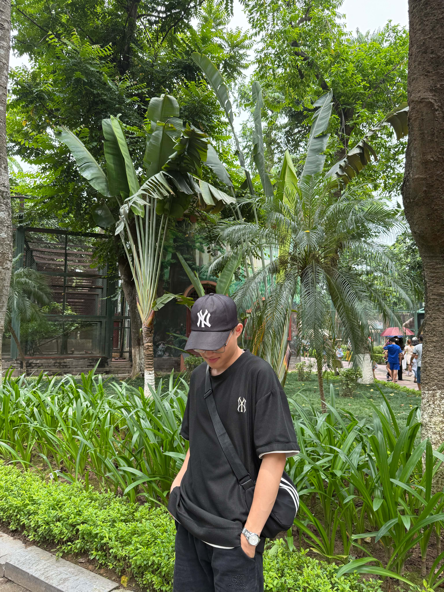

<!doctype html>
<html lang="en">
  <head>
    <link rel="apple-touch-icon" sizes="180x180" href="apple-touch-icon.png" />
    <link rel="icon" type="image/png" sizes="32x32" href="favicon-32x32.png" />
    <link rel="icon" type="image/png" sizes="16x16" href="favicon-16x16.png" />
    <link rel="manifest" href="site.webmanifest" />
    <meta charset="UTF-8" />
    <meta name="viewport" content="width=device-width, initial-scale=1.0" />
    <title>Document</title>
  </head>
  <body>
    <header>
      <h1>THÔNG TIN CÁ NHÂN</h1>
      <nav>
        <a href="#gioithieu" target="_self">Giới thiệu</a> |
        <a href="#sothich" target="_self">Sở thích</a> |
        <a href="#kynang">Kỹ năng</a> |
        <a href="#thoikhoabieu">Thời khóa biểu</a> |
        <a href="#lienhe">Liên hệ</a>
      </nav>
    </header>

    <section id="thongtin">
      <h2>Thông tin cá nhân</h2>
      

      
<strong>Họ và tên:</strong> Nguyễn Quốc Anh

      
<strong>Tuổi:</strong> 19

      
<strong>Trường:</strong> Đại học Công Nghiệp Hà Nội

      
<strong>Ngành học:</strong> Công nghệ thông tin

      
<strong>Lớp:</strong> CNTTTA_01

      
<strong>Email:</strong> anhkhanhnguyen2k7@gmail.com

      
<strong>Số điện thoại:</strong> 0961660611

    </section>

    <section id="gioithieu">
      <h2>Giới thiệu bản thân</h2>
      

        Xin chào! Mình là Nguyễn Quốc Anh, hiện đang là sinh viên ngành Công
        nghệ thông tin tại Đại học Công Nghiệp Hà Nội.
      

      

        Mình có niềm đam mê đặc biệt với lập trình web. Mình mong muốn trong
        tương lai sẽ trở thành một lập trình viên web chuyên nghiệp, có thể xây
        dựng những website hiện đại, tiện ích và mang lại giá trị cho cộng đồng.
      

      

        Để đạt được mục tiêu đó, mình luôn cố gắng học hỏi, rèn luyện kỹ năng
        HTML, CSS, JavaScript và các công nghệ mới để nâng cao khả năng phát
        triển web.
      

      

        Trong tương lai, mình mong muốn trở thành một lập trình viên chuyên
        nghiệp, có thể phát triển các phần mềm và website hữu ích phục vụ cho
        mọi người.
      

    </section>

    <section id="sothich">
      <h2>Sở thích</h2>
      <ul>
        <li>Đọc sách</li>
        <li>Nghe nhạc</li>
        <li>Chơi thể thao</li>
        <li>Du lịch</li>
        <li>Lập trình</li>
      </ul>
    </section>

    <section id="kynang">
      <h2>Kỹ năng</h2>
      <ol>
        <li>HTML</li>
        <li>CSS</li>
        <li>JavaScript</li>
        <li>Git</li>
        <li>C++</li>
      </ol>
    </section>
    <section id="thoikhoabieu">
      <h2>Thời khóa biểu</h2>
      <table border="1">
        <tr>
          <td>Thứ</td>
          <td>Môn học</td>
          <td>Phòng học</td>
        </tr>
        <tr>
          <td>2</td>
          <td>Xác suất thống kê</td>
          <td>209</td>
        </tr>
        <tr>
          <td>3</td>
          <td>Chủ nghĩa xã hội</td>
          <td rowspan="4">Online</td>
        </tr>
        <tr>
          <td>4</td>
          <td>Toán rời rạc</td>
        </tr>
        <tr>
          <td>5</td>
          <td>Tư tưởng HCM</td>
        </tr>
        <tr>
          <td>6</td>
          <td>Toán rời rạc</td>
        </tr>
        <tr>
          <td colspan="3">Tổng cộng 5 buổi học</td>
        </tr>
      </table>
    </section>

    <section id="lienhe">
      <h2>Form liên hệ</h2>
      <form action="/action_page.php">
        <label for="username"> Họ và tên </label> 
        <input type="text" id="name" /> 
        <label for="email" id="email">Email</label> 
        <input type="email" /> 
        <label for="pw" id="password">Mật khẩu</label> 
        <input type="password" /> 
        <label for="gender">Giới tính</label> 
        <input type="radio" name="gioitinh" />Nam
        <input type="radio" name="gioitinh" />Nữ 
        <label for="sothich">Sở thích: </label> 
        <input type="checkbox" />Đọc sách <input type="checkbox" />Lập trình
        <input type="checkbox" />Du lịch <input type="checkbox" />Trải nghiệm
         
        <label for="pursue">Ngành học: </label> 
        <select id="pursue">
          <option value="CNTT">Công nghệ thông tin</option>
          <option value="KTMT">Kỹ thuật máy tính</option>
          <option value="HTTT">Hệ thống thông tin</option>
          <option value="KHMT">Khoa học máy tính</option></select
        > 
        <label for="introduce">Giới thiệu bản thân: </label> 
        <textarea
          name="message"
          id="introduction"
          rows="10"
          cols="40"
        ></textarea
        > 
        <button>Gửi</button>
      </form>
    </section>
    <footer id="lienhe">
      <a href="https://www.facebook.com/nguyenquocanh300107" target="_blank"
        >Facebook:https://www.facebook.com/nguyenquocanh300107</a
      > 
      <a href="https://github.com/nguyenquocanh2k7" target="_blank"
        >Github:https://github.com/nguyenquocanh2k7</a
      > 
      <a
        href="https://mail.google.com/mail/u/0/#inbox?compose=GTvVlcSDbgvHcsxnzhkDNjHmCSMQqZNsRsZLXgXKXZcXZVGhwzXQSSKZZtfXchBcBMrPSWTHqbKdC"
        >Gmail:anhkhanhnguyen2k7@gmail.com</a
      >
      
&copy; 2026 Nguyễn Quốc Anh

    </footer>

  </body>
</html>
